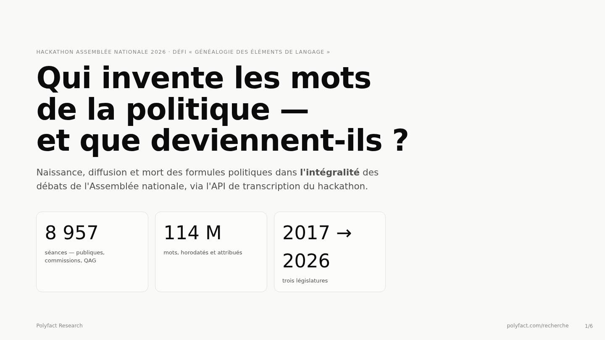

# DEFI.md

### Nom du défi
Généalogie des éléments de langage

### Description courte
Choisir un ou plusieurs éléments de langage et observer leur propagation au sein d'un groupe, puis des autres groupes à travers le temps.

### Porteur
Polyfact (Jules Potel)

### Description longue
Qui invente les mots de la politique, qui les reprend, et que deviennent-ils ? À partir de l'**API de transcription de l'Assemblée nationale publiée pour le hackathon**, nous avons parcouru l'intégralité des débats transcrits — **8 957 séances** (séances publiques, commissions, questions au gouvernement), soit **114 millions de mots** horodatés et attribués à leur orateur, de juin 2017 à juillet 2026 — pour retracer le cycle de vie complet de **25 formules politiques** : leur naissance publique, leur entrée à l'Assemblée, leur diffusion de groupe en groupe et leur mort — ou leur fossilisation.

**Méthode.** Recherche littérale de chaque formule (variantes orthographiques et flexions, exclusions de contextes hors-sujet), avec **audit des faux positifs** sur échantillons, formule par formule ; rattachement de chaque orateur à son **groupe politique à la date de la séance** via les mandats officiels (données ouvertes AMO), ce qui suit correctement les élus qui changent de groupe ; usages exprimés en **occurrences par million de mots prononcés** (le volume transcrit triple entre 2018 et 2025, les comptes bruts sont trompeurs) ; chaque affirmation **contre-vérifiée dans les données** (dates, attributions, comptages).

**Résultats marquants** (sujet présenté : le lexique du Covid et de l'État protecteur) :
- **Les mots du Président entrent à l'Assemblée par la bouche de ses adversaires.** « Quoi qu'il en coûte » (allocution du 12 mars 2020) est repris sept jours plus tard, le même jour, par Éric Woerth (LR), Valérie Rabault (PS) et Fabien Roussel (PCF) — avant la majorité — comme une reconnaissance de dette.
- **79 % des usages de « quoi qu'il en coûte » sont posthumes**, postérieurs à son acte de décès officiel (« le quoi qu'il en coûte, c'est fini », Bruno Le Maire, 30 août 2021). Son pic absolu tombe en octobre 2024, 1 128 jours après. Une formule ne meurt pas : elle se fossilise en catégorie budgétaire.
- **Les généalogies s'inversent.** « Les jours heureux » circulait chez Mathilde Panot (LFI) 118 jours avant l'allocution présidentielle ; « premiers de corvée », forgée par Jean-Luc Mélenchon, dort 919 jours puis entre à l'Assemblée… par un député de la majorité, avant qu'un socialiste ne l'attribue à Emmanuel Macron lui-même. Le stade final d'un élément de langage, c'est l'anonymat.

L'**étude complète** — interactive, bilingue, avec deux autres sujets (le lexique sécuritaire et identitaire venu des marges ; la capture de la « planification écologique ») — est publiée sur **[polyfact.com/recherche](https://polyfact.com/recherche)**. Ce dépôt contient le code d'exploitation de l'API, les agrégats, les diapositives de présentation et le rapport PDF.

### Image principale

### Contributeurs
- Jules Potel

### Ressources utilisées
Cochez les ressources utilisées en remplaçant `[ ]` par `[x]`.

- [ ] `openfisca-france-parameters` — Base de données de paramètres ✺ OpenFisca
- [ ] `an-dossiers-legislatifs` — Dossiers législatifs de l'Assemblée nationale (législature courante) ✺ Assemblée nationale
- [ ] `an-amendements-xvii` — Amendements déposés à l'Assemblée nationale (législature actuelle) ✺ Assemblée nationale
- [ ] `an-comptes-rendus` — Comptes rendus de la séance publique à l'Assemblée nationale (législature actuelle) ✺ Assemblée nationale
- [ ] `an-votes-xvii` — Votes des députés (législature actuelle) ✺ Assemblée nationale
- [ ] `an-deputes-en-exercice` — Députés en exercice ✺ Assemblée nationale
- [x] `an-deputes-historique` — Historique des députés ✺ Assemblée nationale
- [x] `an-deputes-senateurs-ministres-par-legislature` — Députés, sénateurs et ministres d'une législature ✺ Assemblée nationale
- [ ] `an-agenda-reunions` — Agenda des réunions à l'Assemblée nationale (législature courante) ✺ Assemblée nationale
- [ ] `an-questions-gouvernement` — Questions de l'Assemblée nationale au Gouvernement ✺ Assemblée nationale
- [ ] `an-questions-gouvernement-ecrites` — Questions écrites de l'Assemblée nationale au Gouvernement ✺ Assemblée nationale
- [ ] `an-questions-gouvernement-orales` — Questions orales de l'Assemblée nationale au Gouvernement ✺ Assemblée nationale
- [ ] `premier-ministre-legi` — Codes, lois et règlements consolidés ✺ Premier ministre
- [ ] `premier-ministre-dole` — Dossiers législatifs Légifrance ✺ Premier ministre
- [ ] `premier-ministre-jorf` — Édition ''Lois et décrets'' du Journal officiel ✺ Premier ministre
- [ ] `senat-dispositifs-textes` — Dispositifs des textes déposés ou adoptés au Sénat ✺ Sénat
- [ ] `senat-dossiers-legislatifs` — Dossiers législatifs du Sénat ✺ Sénat
- [ ] `senat-amendements` — Amendements déposés au Sénat ✺ Sénat
- [ ] `senat-senateurs` — Sénateurs ✺ Sénat
- [ ] `senat-questions-gouvernement` — Questions orales et écrites du Sénat au Gouvernement ✺ Sénat
- [ ] `senat-comptes-rendus` — Comptes rendus de la séance publique au Sénat ✺ Sénat
- [ ] `an-et-co-database-regroupement-toutes-donnees` — Base de données unifiée Parlement / Législation / Service Public ✺ Assemblée nationale & communauté
- [ ] `an-et-co-serveur-mcp-regroupement-toutes-donnees` — Serveur MCP  - Accès unifié Parlement / Législation / Service Public ✺ Assemblée nationale & communauté
- [ ] `an-et-co-api-regroupement-toutes-donnees` — API - Accès unifié Parlement / Législation / Service Public ✺ Assemblée nationale & communauté
- [ ] `legiwatch-api-parlement` — API Parlement ✺ LegiWatch
- [ ] `legiwatch-database-parlement` — Base de données Parlement ✺ LegiWatch
- [ ] `legiwatch-serveur-mcp-parlement` — Serveur MCP Parlement ✺ LegiWatch

Ressource principale hors liste : **l'API de transcription de l'Assemblée nationale créée pour le hackathon** (séances publiques + commissions 2017-2026, orateurs identifiés et rattachés à leur groupe), exploitée intégralement.

### Galerie
- [Image 1](images/image-1.png)
- [Image 2](images/image-2.png)
- [Image 3](images/image-3.png)

### Documents
- [Diapositives de présentation (PDF)](docs/slides.pdf)
- [Rapport complet (PDF)](docs/rapport.pdf)
